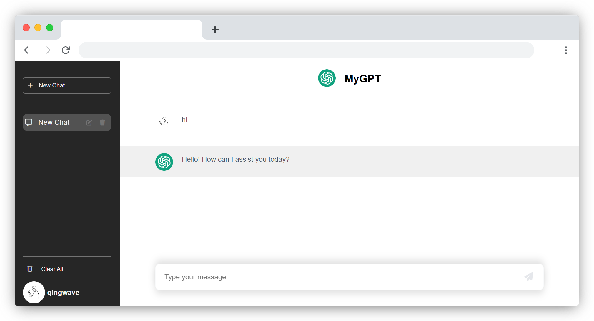

# MyGPT

MyGPT是一个由完全由ChatGPT驱动开发的聊天应用程序，使用Flask作为后端和OpenAI的ChatGPT模型，允许用户与ChatGPT进行实时对话，用户可以创建多个聊天会话，保存聊天历史记录并清除聊天记录。



## 特性
- 类似ChatGPT界面的前后端应用
- 会话使用LocalStorage存储于本地
- 会话管理

## 技术栈
- Flask：用于后端服务器
- OpenAI ChatGPT：用于生成聊天响应
- JavaScript：用于前端交互和动态显示聊天内容
- HTML/CSS：用于构建用户界面
- Font Awesome：用于图标
- Tailwind CSS 和 Tailwind
- Marked: 渲染Markdown

## 运行

1. 配置环境变量，使用以下命令将您的OpenAI API密钥分配给`OPENAI_API_KEY`环境变量：
    ```bash
    export OPENAI_API_KEY=your-api-key-here
    ```
2. 安装python依赖
    ```bash
    pip install flask openai
    ```
3. 运行后端，打开您的浏览器，访问 http://localhost:5000，这是默认的 Flask 服务器地址。您应该看到一个简单的聊天应用界面。
    ```bash
    python your_app_name.py
    ```
